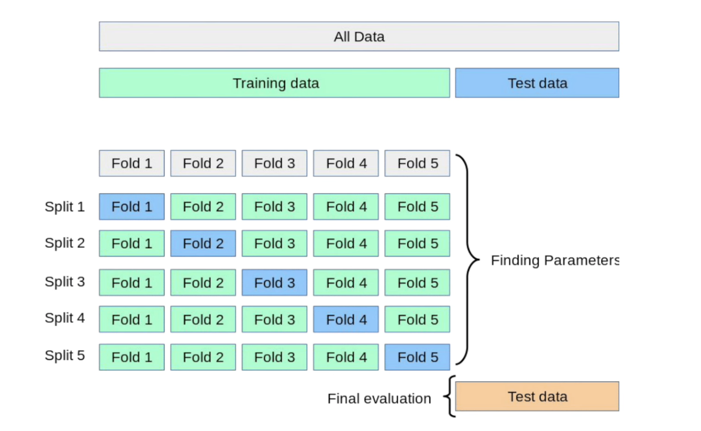
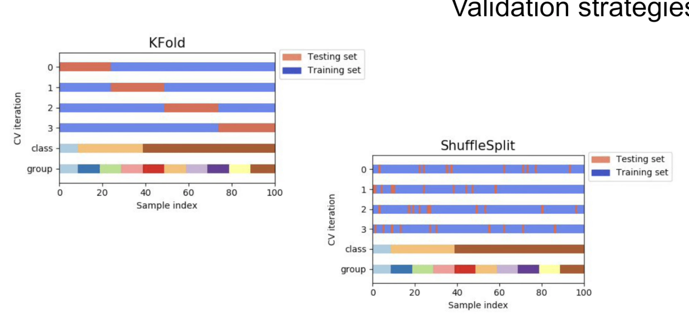
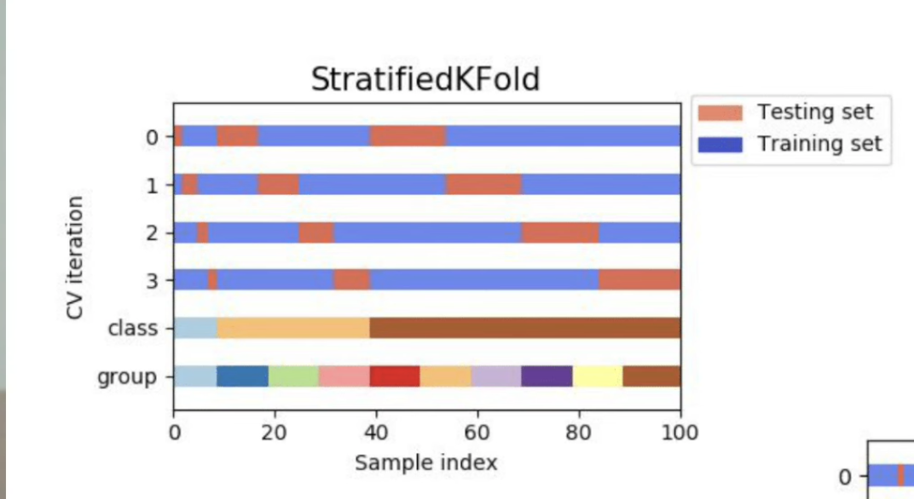
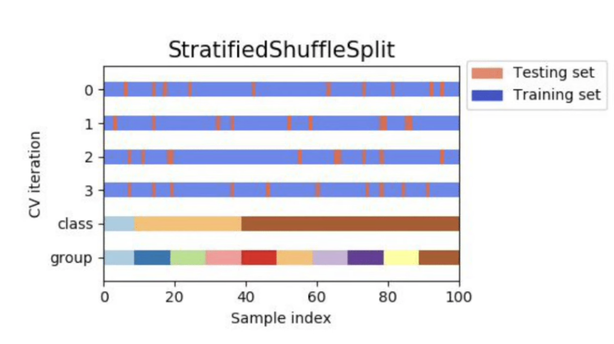

При обучении модели как минимум нужно разбивать выборку на обучающую (train) и тестирующую (test). На одной выборке соответственно модель обучается, а на одной тестируется. Хотя бы так, потому что очевидно, если тестировать и обучать модель на одной и той же выборке, то получатся "слишком хорошие" результаты, поскольку модель обучалась так, чтобы хорошо предсказывать именно ЭТИ данные.

Но даже при разбиение выборки на две части этого бывает мало. В обучающую выборку например могут попасть слишком шумные данные, а в тренировочную какие-нибудь "нормальные", или просто хорошо подходящие именно под нашу модель. В общем панчлайн в том, что этого бывает тоже недостаточно, чтобы быть хоть сколько-то уверенным что модель и правда работает нормально.

Поэтому принято применять техники кросс-валидации:

То есть выборка все так же делится на train и test, а когда мы уже работаем с train, мы применяем кросс валидацию.

Принцип кросс-валидации так же показан на картинке. То есть мы берем наши train данные и делим их снова на train и test. Обучаем и тестируем. Потом берем и делим эти же данные по другому, снова обучаем и тестируем и так несколько раз. По итогу у нас все части побыли тестируемыми и обучающими, и мы получаем какой-то усредненный показатель насколько хорошо у нас справляется модель.

Этот способ называется <u>**KFold**</u>.

Другой способ, показанный на картинке это в целом то же самое, только мы берем не непрерывные куски данных а выбираем их в рандомном порядке. Называется <u>**ShuffleSplit**</u>

<u>**Stratified KFold**</u> учитывает распределения признаков в датасете. То есть, если мы например используем обычный KFold, то возможно, непрерывные куски train подвыборок будут охватывать какие-то конкретные класса (на самом деле вряд ли), ну или как минимум распределение их может быть сильно перекошену в ту или иную сторону.

В общем грубо говоря train выборка в какой-то момент у нас может состоять только из объектов (или почти только), у которых например признак - коричневые глаза. Который является целевым признаком, который мы предсказываем. И тогда, протестировав модель на такой выборке мы лишь сможем быть уверены, что модель хорошо (плохо) определяет коричневые глаза. Короче суть в том, что хорошо бы, чтобы в test выборке были задействованы разношерстные объекты.

То есть мы в фолды набираем данные так, чтобы в них была такая же частота разных классов как и в исходном датасете. А поскольку датасет у нас как бы "случайный", мы предполагаем, что настоящие данные должны выглядеть примерно так же.

<u>**Stratified Shuffle Split**</u> - опять же по сути то же самое все, только выбираем не непрерывные куски данных а рандомные.

Repeated K-Fold
